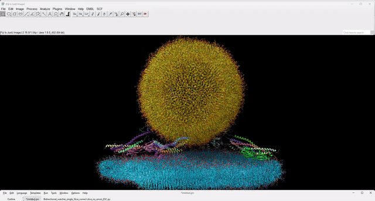

# ROI Sync Watcher

A Python script plugin for [Fiji/ImageJ](https://imagej.net/software/fiji/) that provides **two-way synchronization** between the **Results Table** and the **ROI Manager**.

This is particularly useful when working with many ROIs and corresponding results. The plugin ensures that selecting an entry in the Results Table highlights the corresponding ROI, and _vice versa_.

---

## Features

- ✅ Selecting a row in the Results Table selects the associated ROI (based on ROI label_name).
- ✅ Selecting an ROI in the ROI Manager highlights the corresponding Results Table row (pointing to the correct slice if it relates to a z-stack).
- ✅ Synchronization works across multiple slices (Z-positions), using the label suffix `z:<number>` if present.
- ✅ Watchers run in the background and can be stopped by pressing the `ESC` key.
- ✅ Automatic prevention of duplicate timers.

---
## Demo

---

## How to Use

### Method 1: Run as a Script

1. Open Fiji.
2. Go to **Plugins > Scripting > New**.
3. Set **Language: Python**.
4. Paste the script or open `ROItoResults_sync_watcher.py`.
5. Run the script (`Run > Run` or `Ctrl+R`).
6. A dialog will ask you to start or stop the watchers.
7. Use the `ESC` key to stop the synchronization manually.

---

## Requirements

- Fiji with Jython support (included by default)
- An active **Results Table** and **ROI Manager**
- ROI labels should be of the form:  
  `image_name:roi_name[:z:number]`

---

## 📄 License

This script is released under the [GNU General Public License v3.0](https://www.gnu.org/licenses/gpl-3.0.en.html).

---

## 👤 Author

**Jorge Ramirez-Franco**  
Neuroscience postdoctoral researcher  

---

## 🤝 Contributions

Contributions, suggestions, and improvements are welcome! Feel free to open issues or pull requests.

---
## Acknowledgments

I would like to warmly thank the following members of the Image.sc forum for their helpful advice and support during the development of this plugin:

- [@scouser27](https://forum.image.sc/u/scouser27)  
- [@Nicolas](https://forum.image.sc/u/Nicolas)

Their insights and encouragement were invaluable.

